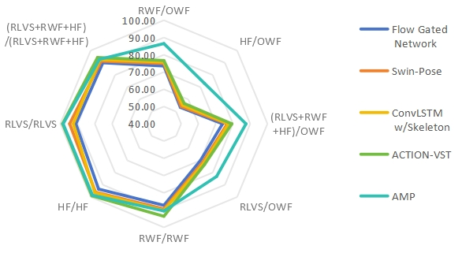
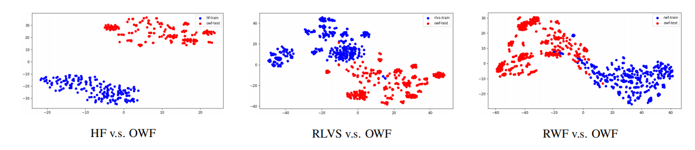
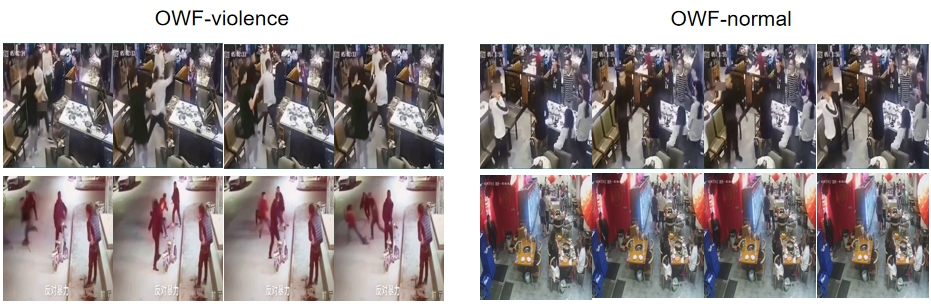

# AMP-OWF
Open World Fights,a carefully curated dataset featuring a variety of scenarios and contexts to serve as a strong benchmark for evaluating generalization capabilities.

AMP: A robust model for detecting out-of-distribution violence, set to be published in the future.

     
    
     

AMP employs multimodal prior knowledge and specialized module design for effective out-of-distribution violence detection.

## OWF Info
The OWF Dataset, collected from TikTok, includes 300 fight videos and 300 non-fight videos, each lasting 2 seconds. 

     
    
     

OWF differs from existing datasets.

## OWF Sample
Contains a variety of complex scenarios, examples are as follows:

     
    
     

## OWF Download
https://drive.google.com/file/d/1rrcNHcst9GzmrtdDtJpMGi_rcspYkljf/view?usp=sharing

## license
This framework is licensed under the Apache License (Version 2.0). Please visit the original resource page for models and datasets and adhere to the respective licenses.

